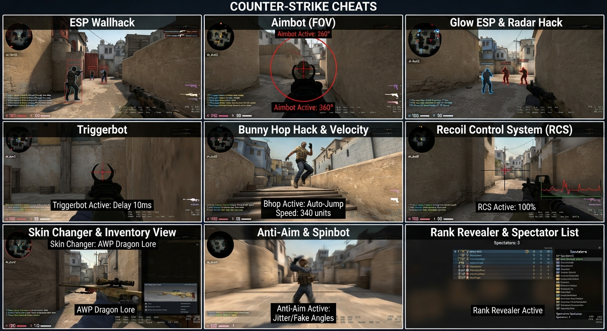

# JohnHansonTheDev — CS2 Internal

A lightweight, stealth-oriented Counter-Strike 2 internal: no menu, no console window, no clutter.
Just extract, inject, and play — everything runs on sensible defaults.

> **A friendly heads-up:** this tool interacts with the game in ways Valve does not
> allow. There is always a risk involved, including a potential VAC ban, and game
> updates can temporarily break features. You are using it entirely at your own
> risk. It is shared for educational purposes.

## What's in the box

| File | What it is |
|---|---|
| `JohnHansonTheDev.dll` | The cheat itself. It must sit next to the injector. |
| `JohnHansonTheDev-Injector.exe` | The launcher that loads the DLL into the game. |

Or simply grab **`JohnHansonTheDev-CS2-v1.0.0.zip`** above — it contains both files.

## Requirements

- Windows 10 / 11, 64-bit
- Counter-Strike 2 installed and updated
- Administrator rights on your PC (the injector needs them)

## How to run it (step by step)

1. **Extract the ZIP** anywhere you like, for example to a folder on your Desktop.
   Make sure `JohnHansonTheDev.dll` and `JohnHansonTheDev-Injector.exe`
   end up **in the same folder** — this part is important.
2. **Start Counter-Strike 2** and join a match (or start a local bot game
   to warm up). Let the map finish loading.
3. **Right-click `JohnHansonTheDev-Injector.exe`** and choose
   **Run as administrator**. A small status window will appear.
4. Wait for the message **`[SUCCESS] Injection complete!`**.
   The status window closes by itself after a few seconds.
5. Switch back into the game. That's it — you're running.

## How to use the aimbot

- **Hold down Mouse 4** (the upper side button on your mouse) and the crosshair
  will lock onto the head of the enemy closest to the center of your screen.
- **Release Mouse 4** at any time to stop aiming instantly and take back
  full manual control.
- Aim assist only ever engages **while the button is held** — when you let go,
  nothing touches your view.

## What is active by default

- **Aimbot** — on, bound to Mouse 4, head targeting with recoil control.
- **Enemy ESP** — boxes and glow on enemies so you always know where they are.
- **Damage numbers** — floating red numbers show the damage you deal.
- **Auto Fire** — off. Turn it on only if you want the weapon to fire by itself
  once locked on. (Shooting is in your hands by default.)
- There is deliberately **no menu and no console** in this build. Everything
  above simply works out of the box.

## Troubleshooting

- **"DLL not found"** — the DLL and the injector must be in the same folder.
  Double-check that first.
- **"Injection failed"** — run the injector as administrator, and make sure
  CS2 is already running before you launch it.
- **Nothing seems to happen in game** — rejoin the match and inject again.
  If CS2 itself just updated, offsets may have shifted until the next release.
- **Antivirus warnings** — injectors routinely get flagged as suspicious.
  Only run files you trust, from sources you trust.

## Version history

- **v1.0.0** — Initial stealth release: aimbot with head lock-on (Mouse 4),
  recoil control, enemy ESP, floating damage numbers. No GUI, no console.

Made with care by **JohnHansonTheDev**. Have fun, play fair-ish, and stay safe.
